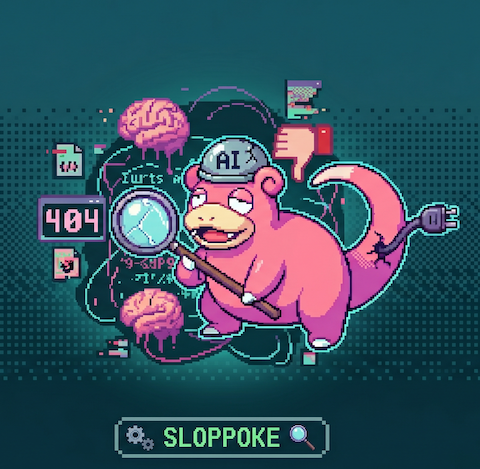

# slop

[](https://github.com/peeramid-labs/slop-cli/releases)
[](https://opensource.org/licenses/MIT)
[](https://slop.peeramid.xyz/)

<p align="center">
  
</p>

**Blazing-fast AI-slop firewall for your git workflow.** Sub-10ms
verdict per patch. Learns from every correction you ship.

```
slop poke                  # scan working tree vs HEAD (default)
slop poke --staged         # scan the staged index
slop poke --range main..HEAD
slop poke --since main     # everything that diverged from main
slop poke --patch foo.patch
slop apply                 # auto-clean flagged lines, amend HEAD
slop learn "this was a false positive on src/foo.rs"
```

## What it catches

| kind | what it is |
|---|---|
| AI scaffolding   | Numbered "Step N" / "First, …" / "Now we will …" comments that document the act of writing the code instead of explaining the code. |
| Naming slop      | Vague verb-led functions and Manager/Helper/Util class names — placeholder identifiers an LLM reaches for when the real name would require thought. |
| Defensive crud   | Empty exception swallows and redundant null guards added "so it doesn't crash" instead of fixing the underlying assumption. |
| Half-finished    | Unfinished-business markers: TODO/FIXME asking the next reader to implement the actual logic. |
| Emoji-in-code    | Emoji embedded in source. Almost never deliberate in a real codebase; nearly always an LLM autograph. |
| Restating code   | Comments that paraphrase the line below them instead of explaining WHY. |
| Dead generics    | Type parameters declared but never referenced — speculative abstraction. |

The detection engine improves continuously, server-side, so the
catalog you scan against today is always the latest one — no
re-install needed.

## Install

### Homebrew (macOS + Linux)

```
brew install peeramid-labs/tap/slop
```

Prebuilt binaries for macOS (arm64 + x86_64) and Linux (arm64 + x86_64).
APT repo still pending.

### Build from source

```
git clone https://github.com/peeramid-labs/slop-cli.git
cd slop-cli
cargo install --path crates/sloppoke-cli
```

Needs rust `1.86+`. One binary, no runtime daemons, no native deps
beyond `ssh-keygen` for request signing. `cargo install` places `slop`
in `~/.cargo/bin/` — make sure that's on your `$PATH`.

## Get started

```
slop login                     # SSH-key handshake; cache identity
slop poke                      # first call: 402 + Stripe Checkout URL
                               # pay → next call lands findings + plan
slop apply                     # auto-strip flagged lines, amend HEAD
slop learn "false positive"    # shapes future scans
```

`slop apply` runs `git apply` + `git commit --amend` locally. Use
`--no-commit` if you want to inspect the staged diff first.

## Learns as you go

slop adapts to **your** code and **your** preferences through machine
learning. Every `slop learn "…"` you submit teaches the engine — for
your account and your project specifically. False positives get
quieter. Real misses get caught next time. The catalog you experience
on day 30 is calibrated to your team's idioms in ways the day-1
catalog could not be.

> slop does not retain user information. Learning signals are folded
> into the model and the raw inputs do not persist.

Per-account learn intake: **100 submissions/month, 1 MiB per
submission.** Plenty for a small team; if you need more, ping
[engineering@peeramid.xyz](mailto:engineering@peeramid.xyz).

## Auth

SSH key = identity. `slop login` picks the key OpenSSH would use for
the server host (same resolution git observes), caches the fingerprint
locally, and signs each request with `ssh-keygen -Y sign`. No accounts,
no signups beyond Stripe checkout.

## Claude skill

`/slop` is bundled as a Claude skill in `skills/slop.md` — wires the
CLI into your agent so it pokes before every commit.

## License

MIT. See `LICENSE`.

---

Built by [Peeramid Labs](https://peeramid.xyz/).
