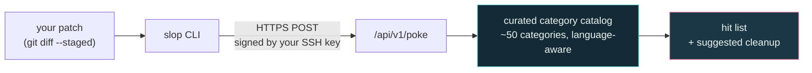
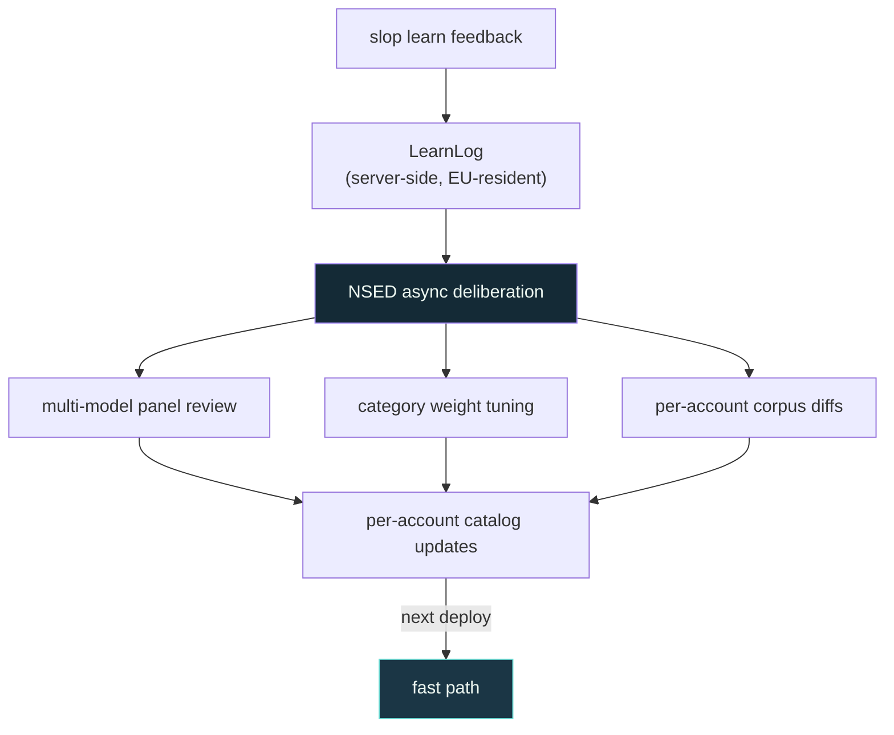

# How detection works under the hood

Sloppoke uses a two-loop architecture. A deterministic pattern
engine in front of your `git commit`, and a multi-model deliberation
pipeline behind it that continuously sharpens the catalog the engine
runs against.

## The fast path

Steps:

1. The CLI reads your patch (`git diff --staged`, a range, a file).
2. It signs the request with your SSH key and POSTs it to
   `/api/v1/poke`.
3. The server matches the patch against a curated category catalog
   that's been distilled from real LLM-assisted diffs across many
   languages and ecosystems.
4. Language-aware analysis walks structural categories that flat text
   matching can't reach: branch coverage, doc-comment presence,
   `#[cfg(test)]` boundaries, framework idioms.
5. Hits are deduplicated, scored, and returned with a `cleanup_actions`
   array.

Sub-10 ms verdict per typical patch. No model in the request path,
no GPU, no per-commit cost. Same patch → same verdict, every time —
the verdict is reproducible, not generative.

## What's in the catalog

See the [catalog reference](../reference/catalog.md) for the full list.
Five buckets cover most of the surface:

- Language-agnostic LLM tells (self-congratulatory verbs,
  defensive crud, narrative comments)
- Language-specific structural traps (Python `bare_except`, Rust
  `unwrap` outside tests, TS `as unknown as`)
- SQL anti-patterns
- Cross-file structural checks (untested branches)
- Comment-marker hunters (FIXME / HACK / XXX / TODO)

Every category has been distilled from real LLM-assisted diffs, not
academic taxonomies. The list grows as new patterns surface in the
wild.

## The slow path — where the intelligence lives

Detection accuracy improves over time via NSED Orchestrator, an
asynchronous multi-model deliberation backend.

What this means for you:

- Every false positive you report (`slop learn "the X warning is wrong
  because…"`) feeds the deliberation loop.
- The loop processes feedback out-of-band — no synchronous latency at
  the commit boundary.
- The model panel that runs deliberation is what powers the rest of
  Peeramid Labs' multi-agent products. Your feedback gets the full
  orchestration backend; you only ever hit the fast scanner from the
  CLI.

## Why this split is the right one

Detection at the commit boundary needs determinism: same patch → same
verdict, every time. Tuning needs intelligence: surfacing patterns no
catalog entry has codified yet.

Mixing them on the hot path would mean a model call per commit, which
would:

- Add seconds of latency to every `git commit`
- Cost real money per commit
- Make every verdict non-reproducible

Splitting them keeps `slop poke` boring, fast, and predictable. The
intelligence lives in the catalog. The catalog learns. You stay on
the fast path.
