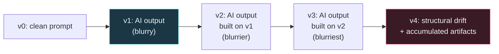
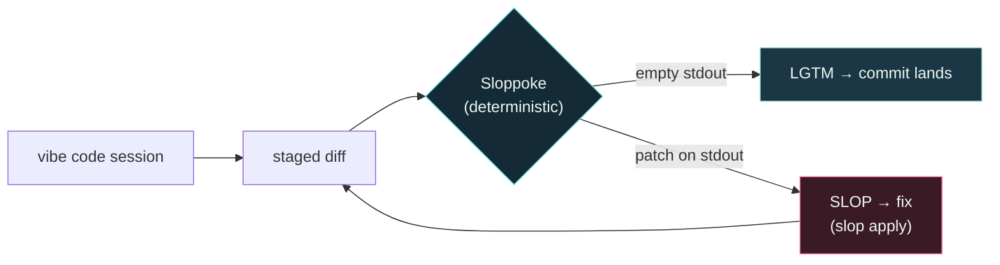

# Why Sloppoke exists: LLMs are lossy compression

Large language models are not databases. They are **lossy compression**
of the text and code they were trained on. Every output is a
statistical approximation of what the training-data distribution
suggests should come next — not a retrieval of an exact prior. That
single fact explains why "vibe coding" works, why it fails the way it
does, and why a deterministic gate at the commit boundary is the
correct fix.

## The thesis

Ted Chiang surfaced this framing for a general audience: ChatGPT, he
wrote in *The New Yorker* (2023), is "a blurry JPEG of the web." The
academic version landed the same year:

- **Delétang et al., 2023.** *Language Modeling Is Compression.*
  Google DeepMind. Shows that training an autoregressive language
  model is mathematically equivalent to compressing the training
  corpus. The model isn't *like* a compressor — it *is* one.

The model doesn't store terabytes of GitHub repositories line by
line. It compresses code and documentation into billions of weights
encoding the latent structure of the data. When it generates, it
predicts what the next correct token should look like, conditioned on
the prompt. The output is plausible. It is not exact.

## Implication 1 — Vibe coding works because the compression generalises

If LLMs were lossless retrieval systems, vibe coding wouldn't exist.
You'd only ever get back exact code snippets that already lived in
the training set, never adapted to your specific codebase.

Compression's lossy nature is what makes the trick work. The model
didn't store every API call individually — it stored **abstractions
and patterns**. Ask for "an auth service in FastAPI using Clean
Architecture" and you get a coherent scaffolding because that
architectural pattern is a strong signal in the compressed
representation. The model interpolates across the training
distribution and emits a structure that respects the requested style.

This is the upside. Vibe coding is fast because the model trades
exactness for generalisation.

## Implication 2 — Compression artifacts ARE hallucinations

A heavily compressed JPEG develops pixelated blocks where detail used
to be. AI-generated code develops the same class of failure:

- An invented API parameter that has the right shape but doesn't
  exist on the real library
- Swapped function arguments (correct types, wrong order)
- An off-by-one in a loop bound
- A defensive `try/except` around an operation that can't raise
- A reference to a module that was never imported

The code looks right because the model selected the most *probable*
token at each step. Probability is not correctness. In the
literature this is studied as hallucination:

- **Ji et al., 2023.** *Survey of Hallucination in Natural Language
  Generation.* ACM Computing Surveys.

Hallucinations are not bugs in the model. They are the inevitable
output of a system that interpolates over a compressed
distribution. You can reduce their frequency. You cannot remove
them.

## Implication 3 — The photocopy effect (entropy accumulation)

Vibe coding is iterative. The AI writes code, you spot a problem, the
AI fixes it, you ask for a refactor, the AI proposes one — each step
feeds the model's previous output back as context.

This is photocopying a photocopy. Compression error compounds across
generations.

Academically this is **model collapse**:

- **Shumailov et al., 2023.** *The Curse of Recursion: Training on
  Generated Data Makes Models Forget.* arXiv:2305.17493.

The original work targets training-time collapse from feeding model
output back into training. The same mechanism shows up at
inference-time too: when the model's context window is dominated by
its own prior output, generation distribution drifts away from the
original signal. Each round introduces small distortions; the
distortions stack.

Without an outside check, a vibe-coded project becomes a fragile
house of cards. The fragility isn't visible in any single diff. It
accumulates over weeks of iterations.

## Implication 4 — Regression to the mean

Lossy compression preserves the high-frequency signal in the
training distribution and smooths over the rare, unusual, or
non-canonical. JPEG keeps the dominant colour bands and discards the
edges of fine grain.

LLMs do the same thing for code. The model gravitates toward the
**average** of what GitHub looks like:

- Standard CRUD scaffolding → near-perfect output
- Boilerplate React/Express/FastAPI → near-perfect output
- A novel optimisation specific to your domain → likely hallucinated
- An esoteric edge case in a niche library → likely hallucinated

The rare-but-correct answer was smoothed out of the weights during
training. The model can only produce what its compressed
distribution can encode. If your real task lives in the tail of the
distribution, no amount of better prompting recovers what was never
preserved.

## The vibe coder's job description

Vibe coding doesn't mean "I do nothing while the AI types." It
means the programmer's role shifts from *code writer* to *compiler
and validator*. The AI is the speculative generator. You are the
deterministic gate.

Because the model output is lossy, you have to build the lossless
safety nets yourself:

1. **Tests (TDD).** A unit test is a deterministic check. It tells
   you exactly which line failed and what it expected. The test
   doesn't care how plausible the code looked.
2. **Strong types.** TypeScript, Rust, Go. The compiler catches
   compression artifacts at build time so they don't become runtime
   incidents.
3. **Architectural control.** The model's context window is bounded;
   its picture of your project is always blurrier than yours. Hold
   the map yourself. The model is a contractor, not the architect.

## Where Sloppoke fits

Tests, types, and architecture each catch a different failure mode.
None of them catch the residue around the working code — the
narrative comments restating the next line, the defensive guards on
impossible inputs, the placeholder identifiers, the half-finished
branches that compile but were never wired in. That residue is also a
compression artifact. The model emitted it because it was the most
probable token shape for the context, not because the code needed
it.

Sloppoke is the **deterministic gate for that residue**, at the
commit boundary, before iteration compounds it.

What that buys you:

- **No photocopy effect.** Residue is stripped before it becomes
  context for the next round. The AI's input next session is the
  cleaned version, not the artifacted one.
- **Deterministic verdict.** Same staged diff → same finding, every
  time. Reproducible.
- **Sub-10ms.** Cheap enough to run on every commit. The model in the
  loop is for *generation*; the gate is for *verification*.
- **Pre-commit, not pre-merge.** Stops the residue before it lands in
  git history. Once it's in main, the next iteration's prompt sees it
  as canonical and amplifies it.

The slow loop — the multi-agent NSED deliberation that tunes the
catalog from your `slop learn` feedback — is where the
intelligence lives. The fast loop is intentionally boring. Boring is
what lets it run on every commit without making you wait.

## Further reading

- Chiang, T. (2023). [*ChatGPT Is a Blurry JPEG of the Web*](https://www.newyorker.com/tech/annals-of-technology/chatgpt-is-a-blurry-jpeg-of-the-web). *The New Yorker.*
- Delétang, G. et al. (2023). [*Language Modeling Is Compression*](https://arxiv.org/abs/2309.10668). arXiv:2309.10668.
- Ji, Z. et al. (2023). [*Survey of Hallucination in Natural Language Generation*](https://dl.acm.org/doi/10.1145/3571730). ACM Computing Surveys 55(12).
- Shumailov, I. et al. (2023). [*The Curse of Recursion: Training on Generated Data Makes Models Forget*](https://arxiv.org/abs/2305.17493). arXiv:2305.17493.
